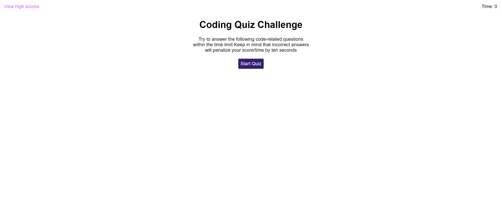

Challenge 4: Coding Quiz Game
 
 In this challenge, our task is to create a coding quiz using HTML, CSS, and JavaScript. My quiz includes a leaderboard and scores based on time and accuracy of the questions. You can also view your past and high scores, as well as reset all saved scores. 
 
 User Story: As a coding boot camp student, I want to take a timed quiz on JavaScript fundamentals that stores high scores, so that I can gauge my progress compared to my peers.
 
 Acceptance Criteria: Given I am taking a code quiz, when I click the start button, then a timer starts and I am presented with a question. When I answer a question, then I am presented with another question. When I answer a question incorrectly, then time is subtracted from the clock. When all questions are answered or the timer reaches 0, then the game is over. When the game is over, then I can save my initials and score.
 
 Link to the deployed application: https://joshahuynh.github.io/Coding-Quiz-Game/
 
 Link to the GitHub repository: https://github.com/joshahuynh/Coding-Quiz-Game
 
 Screenshot:
 
 
